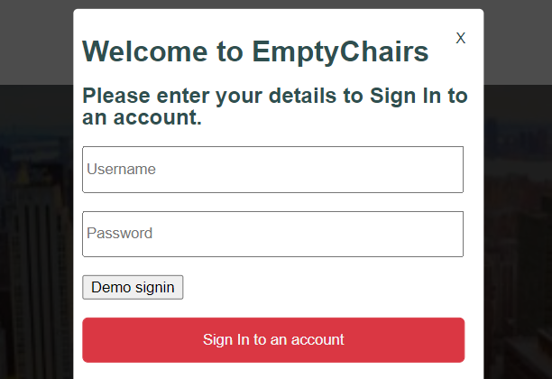

## Description

EmptyChairs is a clone of OpenTable, the popular restaurant reservation app. All visitors can browse and learn more details about restaurants and make reservations.  Logged in users can leave reviews (create, edit, and delete) of restaurants where they have dined, and save favorite restaurants to their user profile page.  

Try it live [here!](https://emptychairs.herokuapp.com/#/)  
(click `Signin` then `Demo signin` for Demo User)

## Technologies, Libraries, APIs

- Ruby on Rails for the backend
- PostgreSQL for the database
- JavaScript/jQuery for frontend code
- React/Redux for creating interactive UI and managing state
- SCSS to style components rendered on the browser
- React-icons library for icons
- AWS Simple Storage Service (S3) for hosting photos 
- Webpack to bundle the files
- Heroku to host the live site

## Features

With EmptyChairs users can:

- Create an account
- Scroll through available restaurants on the homepage seeing a photo, name, and average rating for each restaurant
- Click on a desired restaurant to go to its show page where they can read an overview, access the menu, and read reviews
- Use a form on the restaurant's show page to make a reservation at that restaurant
- View a confirmation page with their reservation details which includes a link to return to the restaurant's show page 
- View a list of all reservations on their profile page, including a link to leave a review for any of those restaurants 
- Toggle a button on the restaurant show page to save/unsave favorites, and view a list of all those favorites on their profile page 

## Coding Challenges

PROBLEM: The default result of a user hitting `Enter` while in a form is that it triggers the same action as mouse-clicking a link or a button will in that same form.  However, if the form has more than one link or button, hitting `Enter` will automatically trigger the action of whichever link or button comes first on the form.  Therefore, if a user hit `Enter` in the signup form/modal, it triggered the `Demo sigin` action rather than the `Sign in to an account` action below it.  I wanted to control the result of the `Enter` event rather then be stuck with default behavior.  

 

SOLUTION:  By adding an inline function to the `<form>` tag I was able to dictate that an onKeyPress of `Enter` trigger the action in the handleSubmit function, which is the same action triggered by clicking `Sign in to an account`, therefore bypassing the `Demo Signin` button.

```javascript
        return(
            <div>
                <form onSubmit={this.handleSubmit} onKeyPress={ (e) => {e.key === "Enter" ? this.handleSubmit(e) : null}}>
                    <h1>Welcome to EmptyChairs</h1> 
                        <h2>Please enter your details to {this.props.formType}.</h2>
```

PROBLEM: I wanted the reservation form to be dynamic to be used by both visitors and logged in users.  I wanted it to pre-fill the first and last name for logged in users, since that information is already in the database, or prompt visitors to enter their first and last name.

SOLUTION: I used ternary logic to display the first name/last name input fields in one of two ways, depending on whether there is a current user signed in or not.  If the former, the form grabs the logged in user's name and pre-fills it in these fields.  If the latter, I used the `placeholder` designation (instead of `value`) to prompt the visitor to enter their first and last name in these fields.  Also, by not requiring a `user_id` in the database or model for resrevations, and setting `belongs_to :user, optional: true` in the reservation model, a reservation can be successfully created and persist to the database with or without a user/user_id.

```javascript
        const display = this.props.currentUser ? (
            <div>
                <input 
                    type="text"
                    defaultValue={this.props.currentUser.first_name}
                    onChange={this.handleInput("first_name")}
                    className="reservation-input"
                />
                <br />
                <br />
                <input 
                    type="text"
                    defaultValue={this.props.currentUser.last_name}
                    onChange={this.handleInput("last_name")}
                    className="reservation-input"
                />
                <br />
                <br />
            </div>
        ) : (
        <div>
            <input 
                type="text"
                placeholder="First Name"
                onChange={this.handleInput("first_name")}
                className="reservation-input"
            />
            <br />
            <br />
            <input 
                type="text"
                placeholder="Last Name"
                onChange={this.handleInput("last_name")}
                className="reservation-input"
```

## Future Implementations

- Restaurant search bar across splash photo at top of homepage
- Loyalty program where users earn/redeem points for completed reservations
- Variety of user and/or restaurant-uploaded photos viewable on the restaurant show page
- On click ("get directions" button) user is taken to Google maps with current location and restaurant location pre-filled
